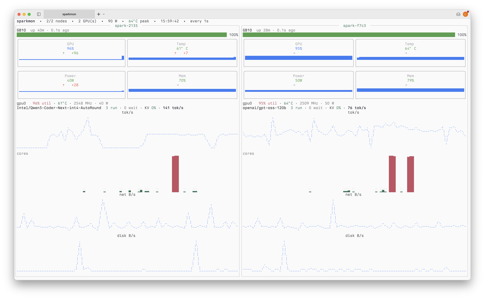

# sparkmon

A terminal dashboard for a small **NVIDIA DGX Spark** cluster — host, GPU, and
**vLLM inference** metrics for every node on one screen. It polls
`node_exporter`, NVIDIA `dcgm-exporter`, and (optionally) vLLM's `/metrics`
over plain HTTP. No Prometheus, no Grafana, no browser.



Built with [`jig`](https://github.com/atterpac/jig) (a `tview`-based TUI
toolkit). Inspired by [paul-aviles/NVIDIA-DGX-Spark-Dashboard](https://github.com/paul-aviles/NVIDIA-DGX-Spark-Dashboard).

## Why

The DGX Spark's GB10 superchip shares one ~128 GB unified LPDDR5X pool between
the Grace CPU and the Blackwell GPU. That changes what monitoring matters:
memory pressure is a *node* problem (an over-eager vLLM config can hard-lock
the box, not just OOM the process), and thermal/power throttling on the compact
chassis quietly eats your tok/s. sparkmon is built around exactly those
signals — unified memory %, GPU temp/power against the GB10 envelope, SM-clock
throttle detection, and live vLLM serving stats — without standing up a
Prometheus stack for a two-node cluster.

## Install

### One-line install (Linux & macOS)

```bash
curl -fsSL https://raw.githubusercontent.com/leonkozlowski/sparkmon/main/install.sh | bash
```

Downloads the right prebuilt binary for your OS/arch from the latest GitHub
release into `/usr/local/bin` (falls back to building with your Go toolchain if
no release asset matches). Options:

```bash
# custom location, no sudo needed
curl -fsSL https://raw.githubusercontent.com/leonkozlowski/sparkmon/main/install.sh | bash -s -- --bin-dir ~/bin
# pin a version
curl -fsSL https://raw.githubusercontent.com/leonkozlowski/sparkmon/main/install.sh | bash -s -- --version v0.1.0
```

### go install

```bash
go install github.com/leonkozlowski/sparkmon/cmd/sparkmon@latest
```

### From source

Needs Go 1.25+. Builds anywhere — your laptop, or one of the Spark nodes.

```bash
git clone https://github.com/leonkozlowski/sparkmon.git
cd sparkmon
just build            # → bin/sparkmon        (or: go build -o bin/sparkmon ./cmd/sparkmon)
just build-arm        # → bin/sparkmon-linux-arm64, for the DGX Spark nodes
```

### Debian package

```bash
just deb              # package for this machine's arch → dist/sparkmon-<arch>.deb
just deb-arm          # package for the Spark nodes (arm64)
sudo apt install ./dist/sparkmon-arm64.deb
```

## Quick start

### 1. Run the exporters on each DGX Spark node

These are the only things that run *on* the nodes (two small containers).
Prereqs per node: Docker + Compose plugin, and the NVIDIA Container Toolkit
(DGX OS ships with it; otherwise see the
[install guide](https://docs.nvidia.com/datacenter/cloud-native/container-toolkit/latest/install-guide.html);
verify with `docker run --rm --gpus all ubuntu nvidia-smi`).

From your workstation:

```bash
sparkmon deploy me@spark-01 me@spark-02
```

This SSHes to each target, uploads the embedded `docker-compose.yml`
(`internal/exporters/docker-compose.yml` in this repo, if you'd rather deploy
by hand), pulls the images, and brings the stack up. Then check reachability:

```bash
sparkmon health spark-01 spark-02
```

Tear it down later with `sparkmon teardown me@spark-01 me@spark-02`
(add `--purge` to also remove `~/sparkmon-exporters` on each node).

### 2. Run the dashboard

No config file needed to try it:

```bash
sparkmon -nodes spark-01=192.168.1.101,spark-02=192.168.1.102
# serving LLMs? add the vLLM metrics port:
sparkmon -nodes spark-01=192.168.1.101,spark-02=192.168.1.102 -vllm-port 8000
```

For everyday use, create a config once and then plain `sparkmon` works:

```bash
mkdir -p ~/.config/sparkmon
curl -fsSL https://raw.githubusercontent.com/leonkozlowski/sparkmon/main/config.yaml.example \
  -o ~/.config/sparkmon/config.yaml
$EDITOR ~/.config/sparkmon/config.yaml    # put your node IPs in it
sparkmon
```

## What it shows, per node

- **Status line** — GPU model, node uptime, scrape freshness, plus a red
  `THROTTLING` badge when a busy GPU's SM clock sags well below its observed
  peak (the tell for thermal/power throttling).
- **Health bar** — a 0–100 score folding in CPU/memory/disk pressure, GPU
  temperature, and throttling.
- **2×2 KPI cards** — GPU util, temperature, power, and unified memory %, each
  with a trend arrow and sparkline. Thresholds are tuned to the GB10 envelope
  (temp warns at 80 °C, power at 110 W, memory at 80 %). Memory is shown once,
  unified: on GB10, "VRAM" and system RAM are the same physical pool.
- **Per-GPU line** — util, temp, SM clock, power draw for each GPU.
- **vLLM serving line + tok/s graph** *(when a `vllm_port` is configured)* —
  served model name, running/waiting request counts (waiting turns yellow:
  backpressure), KV-cache utilization %, and live generation tok/s.
- **Per-core CPU grid**, **network B/s**, and **disk B/s** graphs.

The top bar aggregates the cluster: nodes up, GPU count, total power draw, and
peak GPU temperature. A node that stops responding flips to `DOWN` with the
error, and recovers automatically.

### Keys

- `r` — refresh now
- `t` — cycle theme (26 built-in `jig` themes)
- `q` / `Ctrl-C` — quit

## Configuration

`sparkmon` looks for a config file in this order; the first that exists wins:

1. `-config <path>` (explicit override)
2. `$XDG_CONFIG_HOME/sparkmon/config.yaml`
3. `~/.config/sparkmon/config.yaml`  ← recommended
4. `~/.sparkmon/config.yaml`         ← legacy
5. `./config.yaml`                   ← dev convenience

Schema (see [`config.yaml.example`](config.yaml.example)):

```yaml
interval: 1s              # poll cadence; 1s is fine over a LAN/Tailscale
timeout: 10s              # per-scrape budget (default: max(5s, 4×interval), ≤30s)
history: 60               # points kept per sparkline
theme: tokyonight-night   # optional; any built-in jig theme
nodes:
  - name: spark-01
    host: 192.168.1.101
    vllm_port: 8000       # scrape vLLM /metrics: tok/s, queue depth, KV-cache
  - name: spark-02
    host: 192.168.1.102
    # node_port: 9100     # override if the exporters aren't on the defaults
    # gpu_port: 9400
```

Dashboard flags (each overrides the config file): `-config <file>`,
`-nodes name=host,…`, `-interval 2s`, `-theme <name>`, `-vllm-port 8000`
(applies to every node; use per-node `vllm_port:` in the config for mixed
setups).

## CLI

`sparkmon` is one binary with subcommands; the dashboard runs by default.

```text
sparkmon                              # dashboard (= sparkmon dashboard)
sparkmon deploy   me@spark-01 ...     # upload + bring up the exporter stack
sparkmon teardown me@spark-01 ...     # stop the stack (--purge removes ~/sparkmon-exporters)
sparkmon health   spark-01 ...        # probe TCP + /metrics on :9100 and :9400
sparkmon version
sparkmon help
```

`deploy` and `teardown` shell out to the system `ssh`, so your `~/.ssh/config`,
agent, and known hosts all work as you'd expect.

## What's where

| Path | What it is |
|---|---|
| `cmd/sparkmon/` | the binary entrypoint (subcommand router) |
| `internal/cli/` | subcommands: `dashboard`, `deploy`, `teardown`, `health`, `version` |
| `internal/config/` | config file + flag parsing |
| `internal/metrics/` | HTTP scrape + Prometheus-text parser + per-node snapshots/rates |
| `internal/ui/` | the `jig` dashboard |
| `internal/exporters/docker-compose.yml` | `node_exporter` + `dcgm-exporter` stack — embedded in the binary |
| `Justfile` | `just build`, `just deb`, … (needs [`just`](https://github.com/casey/just)) |
| `install.sh` | the curl installer |

## Notes

- **DGX Spark is ARM64.** The exporter images (`prom/node-exporter`,
  `nvcr.io/nvidia/k8s/dcgm-exporter`) publish `linux/arm64`, and
  `just build-arm` cross-compiles the TUI for the nodes too.
- **GPU metrics refresh.** `dcgm-exporter` collects on its own internal
  interval (coarse by default) — set `DCGM_EXPORTER_INTERVAL=1000` on the node
  if you want GPU metrics to actually move every second.
- **`dcgm-exporter` GPU access.** The compose file uses the
  `deploy.resources.reservations.devices` syntax; swap it for `runtime: nvidia`
  if your Docker is set up the older way.
- **No GPU metrics?** If `dcgm-exporter` can't enumerate the GB10 on your DGX
  OS build, the dashboard shows "no GPUs reported" for that node and keeps
  working on host metrics.
- **Firewall.** The host running `sparkmon` must reach `tcp/9100` and
  `tcp/9400` (and your vLLM port, if configured) on each node.
- **Trade-offs vs. Prometheus + Grafana:** same exporters, same metrics, but no
  long-term history (sparklines hold the last `history` points), no alerting,
  and it's local to your terminal rather than a shared web UI.

## Releasing

Pushing a `v*` tag builds `linux`/`darwin` × `amd64`/`arm64` binaries and
attaches them to a GitHub release (`.github/workflows/release.yml`) — that's
what `install.sh` downloads.

## Roadmap ideas

- A per-node drill-down view (full-screen, more panels)
- Threshold coloring + an alerts pane (GPU temp, disk full, node down)
- Optional on-disk history so sparklines survive a restart
- Mouse/scroll for picking a node
